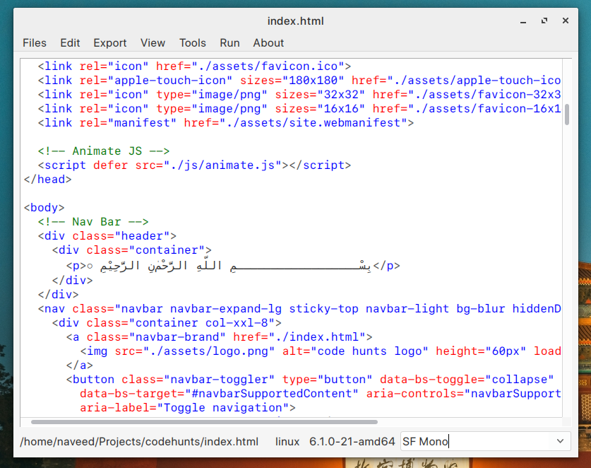
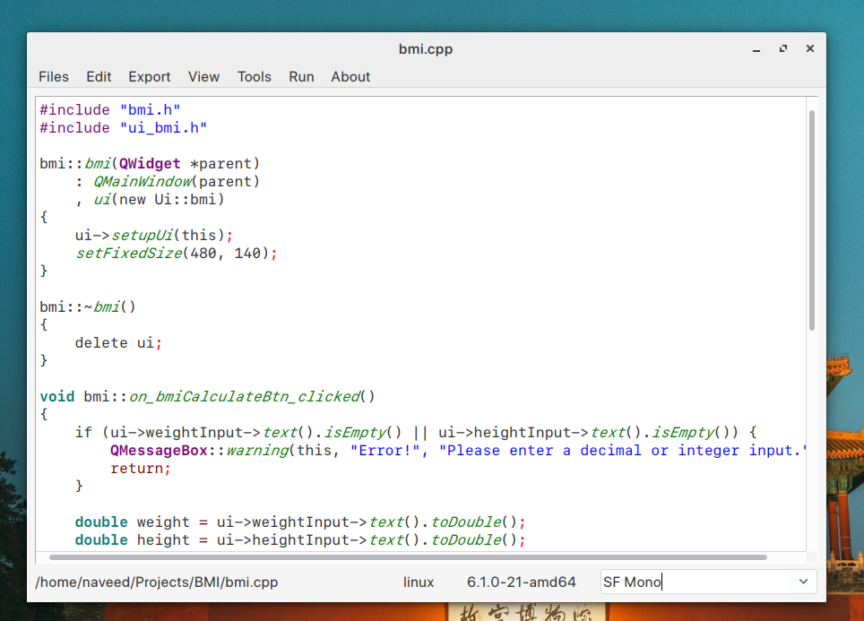
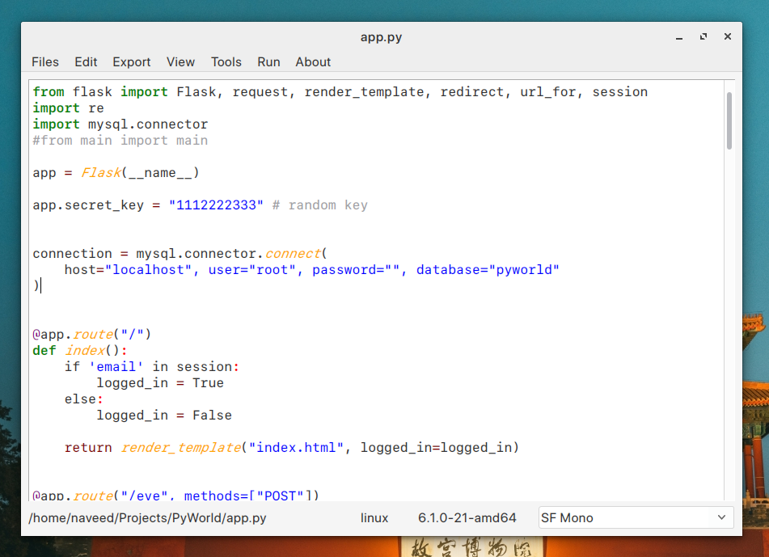
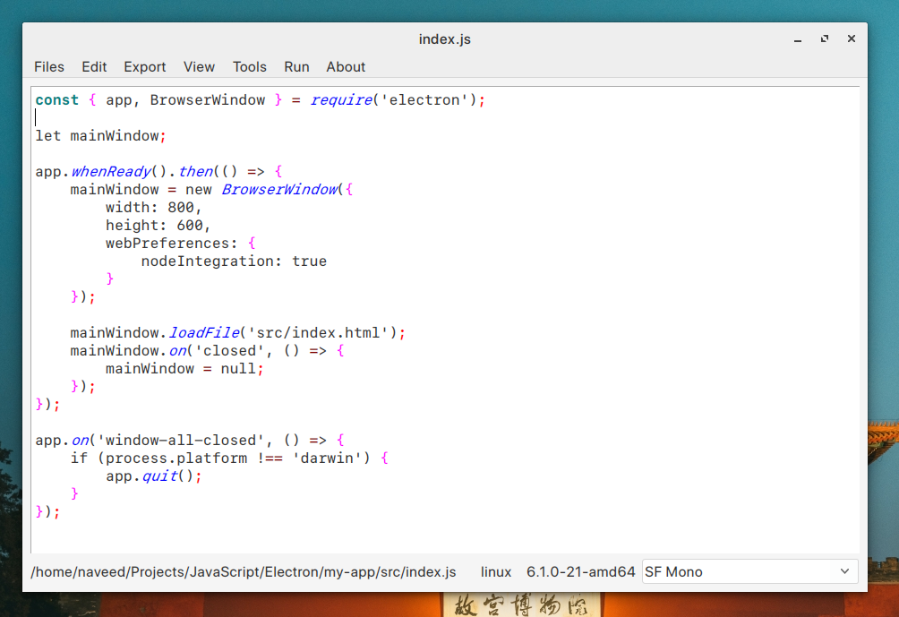

# QNotePad
A typicall notepad to be run on any operating system

## Features:
* print pages.
* print preview.
* Export to html.
* Syntax highlight for(Java Script, Html, C++, Python).
* Convert to html escape.
* Insert comments.
* Insert time.
* Word count.
* Run html files.
* Run spyder files.
* Search on google.
* Provide styles Kvantum, breeze, Windows, Fusion.

### Build on windows:
* Open qt creator, open project and build.

### Build on Linux:
* Open terminal at project folder, write the followings:
    * qmake
    * make
* This will generate the binary file.

